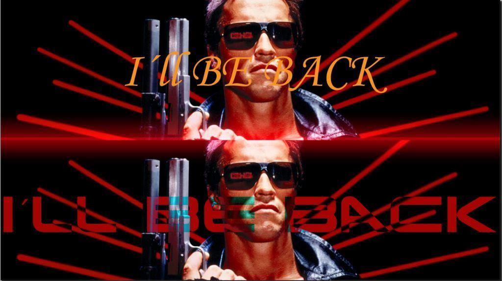

<!-- configuracion de colores es opcional pero ultil-->
<section id="themes">
	<h2>Themes setting</h2>
	

		Themes:  
		<a href="?#/themes">Default</a> -
		<a href="?theme=sky#/themes">Sky</a> -
		<a href="?theme=beige#/themes">Beige</a> -
		<a href="?theme=simple#/themes">Simple</a> -
		<a href="?theme=serif#/themes">Serif</a> -
		<a href="?theme=night#/themes">Night</a>  
		<a href="?theme=moon#/themes">Moon</a> -
		<a href="?theme=solarized#/themes">Solarized</a>
	

</section>

Slide:
     
# User Experience

Teacher:

Mateo Rojas

Slide:

 

Slide:

###Apuntes

* Utilidad
  
  - ¿Cómo creo necesidades?<!-- .element: class="fragment" data-fragment-index="1"-->
  
* Usabilidad<!-- .element: class="fragment" data-fragment-index="2"-->

  - El producto que se ofrezca debe ser funcional, efectivo y eficiente.<!-- .element: class="fragment" data-fragment-index="3"-->

Slide:

 

Slide:

###Apuntes

* En la anterior slide, la imagen de Swacheneger en la parte inferior transmite la sensación de ser de los años 80 por el tipo de fuente utilizado para escribir "I'LL BE BACK".<!-- .element: class="fragment" data-fragment-index="1"-->

* Mientras que la imagen de la parte superior ya transmite otra cosa debido al cambio del tipo de fuente.<!-- .element: class="fragment" data-fragment-index="2"-->

Slide:

 

Slide:

###Apuntes

* Hacerse siempre la pregunta ¿Para qué estoy haciendo el juego?<!-- .element: class="fragment" data-fragment-index="1"-->

* No hacer por hacer.<!-- .element: class="fragment" data-fragment-index="2"-->

* Por ejemplo, si en mi juego se corre, el hecho de correr debe tener una utilidad.<!-- .element: class="fragment" data-fragment-index="3"-->

Slide:

 

Slide:

###Apuntes

* Un juego es un producto industrial.<!-- .element: class="fragment" data-fragment-index="1"-->

* Las productos suplen una necesidad y tienen una utilidad.<!-- .element: class="fragment" data-fragment-index="2"-->

* Preguntarse ¿Cuál es la utilidad del juego?<!-- .element: class="fragment" data-fragment-index="3"-->

  - Mi juego es útil en la medida en que logre 'enganchar' al jugador.<!-- .element: class="fragment" data-fragment-index="4"-->

  - O en la medida en que genero placer en el jugador.<!-- .element: class="fragment" data-fragment-index="5"-->
  

Slide:

 

Slide:

###Apuntes

* La efectividad, eficiencia y satisfacción deben ser probadas con el usuario.<!-- .element: class="fragment" data-fragment-index="1"-->

* Los tres criterios dependen de los tipos de jugador que hay.<!-- .element: class="fragment" data-fragment-index="2"-->

Slide:

 

Slide:

###Apuntes

* Conocer
  - Condiciones espaciales.<!-- .element: class="fragment" data-fragment-index="1"-->
  - Condiciones sicológicas<!-- .element: class="fragment" data-fragment-index="2"-->
  - Qué tipos de personajes le gustan<!-- .element: class="fragment" data-fragment-index="3"-->
  
* Diseñar<!-- .element: class="fragment" data-fragment-index="4"-->
  - Diseño de reglas para solucionar problemas que se presenten en las condiciones identificadas.<!-- .element: class="fragment" data-fragment-index="5"-->
  
* Validar (1 de 2)<!-- .element: class="fragment" data-fragment-index="6"-->
  - Hacer grupos de foco.<!-- .element: class="fragment" data-fragment-index="7"-->
  - La validación se debe hacer directamente con los usuarios, puesto que le es imposible a uno como creador del juego sustituir a otras personas que tienen cosmovisiones distintas.<!-- .element: class="fragment" data-fragment-index="8"-->

Slide:

###Apuntes

* Validar (2 de 2)

  - La idea de validar es mirar cómo se siente la persona.<!-- .element: class="fragment" data-fragment-index="1"-->
  - Ver si realmente se cumplen los objetivos que uno tiene.<!-- .element: class="fragment" data-fragment-index="2"-->

Slide:

 

Slide:

###Apuntes

* Llegamos a las decisiones
* Target<!-- .element: class="fragment" data-fragment-index="1"-->
  - ¿A qué tipo de gente le quiero llegar?<!-- .element: class="fragment" data-fragment-index="2"-->
* Dispositivos<!-- .element: class="fragment" data-fragment-index="3"-->
  - Hay que conocer las limitaciones que tienen. <!-- .element: class="fragment" data-fragment-index="4"-->
    - Por lo general son técnicas.<!-- .element: class="fragment" data-fragment-index="5"-->
  - Hay que pensar cómo trabajar con esas limitaciones.<!-- .element: class="fragment" data-fragment-index="6"-->
    - Las limitaciones también pueden estar relacionadas con el equipo humano de trabajo.<!-- .element: class="fragment" data-fragment-index="7"-->

Slide:

###Apuntes

* Controles 
  - Deben ser intuitivos.<!-- .element: class="fragment" data-fragment-index="1"-->
  - A menos que quiero que sean difíciles.<!-- .element: class="fragment" data-fragment-index="2"-->
    - Ej: Videojuego Meat Boy<!-- .element: class="fragment" data-fragment-index="3"-->
    - Ej: Videojuego Gran turismo:<!-- .element: class="fragment" data-fragment-index="4"-->
      - Es casi un simulador.<!-- .element: class="fragment" data-fragment-index="5"-->
      - Enfocado a un público 'gomoso' de los carros.<!-- .element: class="fragment" data-fragment-index="6"-->
      - Los controles son muy justos.<!-- .element: class="fragment" data-fragment-index="7"-->
      
Slide:

###Apuntes   

* Metajuego

  - Se busca afianzar la experiencia del jugador.<!-- .element: class="fragment" data-fragment-index="1"-->
  - El metajuego también nos sirve para encontrar nuevas propuestas de narrativas.<!-- .element: class="fragment" data-fragment-index="2"-->

* Progresión-Balanceo<!-- .element: class="fragment" data-fragment-index="3"-->

  - ¿Cómo pensamos el metajuego, las reglas, los menús ...?<!-- .element: class="fragment" data-fragment-index="4"-->
  - Es buscar una narrativa consecuente. <!-- .element: class="fragment" data-fragment-index="5"-->

      
      
      
      
      

